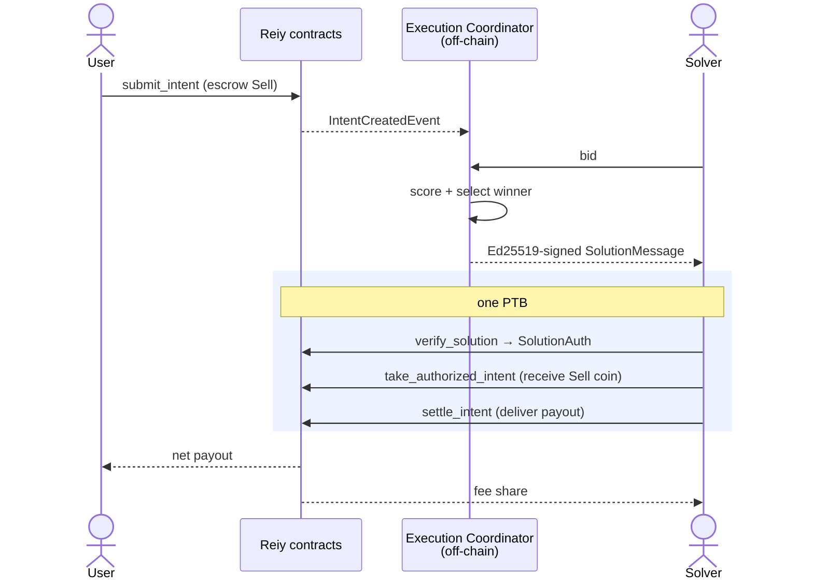

# Reiy Protocol — Move Contracts

On-chain intent escrow and certificate-based settlement for the Reiy intent DEX on Sui. Bid
collection, scoring, and winner selection run off-chain in the **Execution Coordinator**; the chain
escrows user funds, verifies the Coordinator's signed solution, enforces each user's protection, and
splits fees. Move 2024, DeepBook v3.

> Solver integrators: see [SOLVERS.md](SOLVERS.md) for the settlement call sequence.

## Architecture



| Layer | Responsibility |
| --- | --- |
| On-chain | Intent escrow, certificate verification, payout-floor enforcement, fee split, settlement events. |
| Off-chain (Coordinator) | Bid intake, scoring, winner selection, certificate signing + reissue on solver timeout. |
| Solver | Bid to the Coordinator; on win, source liquidity and settle the signed solution on-chain. |

## Modules

| Module | Role |
| --- | --- |
| `config` | `GlobalConfig` (shared) + `AdminCap` (owned): parameters, ACL, allowlists, Coordinator key. |
| `intent_book` | `Intent<Sell, Buy>` shared object: SBBO-gated creation, escrow, partial-fill, cancel. |
| `auction` | Slim `AuctionState` (shared): epoch counter, per-epoch partial-fill set, fee totals. |
| `settlement` | Certificate verification + per-intent settlement, fee split, user protection. |
| `solver_registry` | `SolverRegistry<Stake>` (shared): solver bond + active status. |
| `fee_vault` | `FeeVault<T>` (shared): per-token protocol fee balance. |
| `price_adapter` | DeepBook mid-price reader + SBBO helper math. |
| `events`, `math`, `types` | Event structs, fixed-point helpers, `PairKey`. |

## On-chain objects

| Object | Kind | Notes |
| --- | --- | --- |
| `GlobalConfig` | shared | One per deployment. All mutations require `AdminCap`. |
| `AdminCap` | owned | Held by deployer; transfer to multisig for mainnet. |
| `AuctionState` | shared | Protocol state; pinned by `SolutionMessage.protocol_state_id`. |
| `SolverRegistry<Stake>` | shared | Solver bonds; `Stake` is the bond coin type. |
| `FeeVault<T>` | shared | Canonical fee sink for token `T`, registered in config. |
| `Intent<Sell, Buy>` | shared | Holds escrowed `Sell`; source of truth for one user order. |

## Lifecycle

### 1. Submit intent (user)

```move
auction::submit_intent_sell_base<Base, Quote>(
    state, config, pool, coin: Coin<Base>, min_amount_out,
    slippage_tolerance_bps, partial_fillable, deadline, clock, ctx,
): ID
// or submit_intent_sell_quote<Base, Quote>(...) to sell the quote side
```

Reads the DeepBook mid, computes an **SBBO floor**, and rejects `min_amount_out` below it. The
`Sell` coin is escrowed in a shared `Intent`. Cancel before settlement with
`auction::cancel_intent<Sell, Buy>(state, intent, ctx)`.

### 2. Authorize a solution (Coordinator, off-chain)

The Coordinator Ed25519-signs the BCS bytes of `SolutionMessage`, binding: `protocol_state_id`,
`config_id`, `key_version`, `epoch`, `solution_id`, `solver`, `sell_type`, `buy_type`, and the
parallel `intent_ids` / `fills` / `gross_payouts` / `protected_mins`, plus `expires_at_ms`.

### 3. Settle (solver, one PTB)

`verify_solution` (checks signature, sender, epoch, token types, expiry) → `SolutionAuth` hot-potato →
`take_authorized_intent_full|partial` per intent in order → deliver `payout: Coin<Buy>` via
`settle_intent`. Full sequence in [SOLVERS.md](SOLVERS.md).

## User protections (enforced on-chain)

Per intent, settlement aborts unless all hold:

- `gross_payout ≥ protected_min ≥ min_amount_out` (and `≥ m_eff` for the filled fraction).
- `gross_payout − volume_fee ≥ protected_min` (floor survives the volume fee).
- `payout.value() == gross_payout` (solver delivers exactly the certified amount).
- Intent not expired, `target_epoch == epoch`, not already (partial-)filled this epoch.
- Full fill consumes the whole remaining intent; partial fill is `0 < fill < remaining` and rolls the
  residual to the next epoch.

A bad settlement aborts the PTB — escrow never moves.

## Fees

On each settled intent, over `gross` payout in the `Buy` token:

```text
volume_fee  = gross × volume_fee_ppm(pair) / 1e6        # require gross − volume_fee ≥ protected_min
surplus     = gross − volume_fee − protected_min
surplus_fee = min(surplus × surplus_fee_ppm,  gross × surplus_fee_cap_ppm) / 1e6
total_fee   = min(volume_fee + surplus_fee,   gross × max_total_fee_ppm)   / 1e6
solver_fee  = total_fee × solver_fee_share_ppm / 1e6     # paid to the solver immediately
protocol_fee= total_fee − solver_fee                     # → FeeVault<Buy>
net         = gross − total_fee                           # → user
```

| Parameter | Launch default |
| --- | --- |
| Standard volume fee | 75 ppm (0.75 bps) |
| Correlated volume fee | 10 ppm (0.1 bps) |
| Surplus fee share | 100_000 ppm (10%) |
| Surplus fee cap | 1_000 ppm (0.10% of gross) |
| Max total fee | 1_500 ppm (0.15%) |
| Solver fee share | 350_000 ppm (35% of total fee) |

Per-pair overrides via `FeeTier` (`Standard` / `Correlated` / `Custom(ppm)` / `Disabled`).

## Solver registration

```move
solver_registry::register_solver<Stake>(registry, config, stake: Coin<Stake>, url, ctx) // stake ≥ min_solver_stake
solver_registry::top_up_stake<Stake>(registry, stake, ctx)
solver_registry::withdraw_available_stake<Stake>(registry, amount, ctx)
solver_registry::deregister_solver<Stake>(registry, ctx): Coin<Stake>
```

A solver is *active* (may settle) while registered with `stake ≥ min_solver_stake`. The bond is a
passive eligibility deposit; orchestration and any penalties are handled by the Coordinator.

## Configuration & administration

All setters require `AdminCap`; reads are public. Roles are managed by an ACL
(`grant_role` / `revoke_role`, `ROLE_CONFIG_ADMIN`).

- **Pairs:** `register_fee_vault<Buy>` before `add_supported_pair<Sell, Buy>`.
- **Fees:** `set_standard_volume_fee_ppm`, `set_correlated_volume_fee_ppm`, `set_surplus_fee_ppm`,
  `set_surplus_fee_cap_ppm`, `set_max_total_fee_ppm`, `set_solver_fee_share_ppm`,
  `set_pair_fee_tier<Sell, Buy>`.
- **Coordinator:** `set_execution_coordinator(pubkey: vector<u8> /*32B Ed25519*/, key_version)`.
- **Canonical bindings:** `set_solver_registry_id`, `register_fee_vault<T>` (set-once style).
- **Fee withdrawal:** `fee_vault::withdraw_fees<T>(vault, amount, cap, ctx)`.

## Events

`IntentCreatedEvent`, `IntentCancelledEvent`, `IntentUpdatedEvent`, `EpochAdvancedEvent`,
`SolutionAuthorizedEvent`, `SettlementEvent`, `SettlementFeeChargedEvent`, `BatchFeeSummaryEvent`,
`SolverFeePaidEvent`, `ProtocolFeeCollectedEvent`, `SolverRegisteredEvent`, `SolverDeregisteredEvent`,
`FeeVaultRegisteredEvent`, `ExecutionCoordinatorUpdatedEvent`, `ConfigUpdatedEvent`,
`RoleGrantedEvent`, `RoleRevokedEvent`.

## Deployment

Breaking architecture change from the on-chain-auction version: deploy a fresh package and fresh
objects (no in-place upgrade). After publish, initialize in order:

1. `init_registry<Stake>` → `set_solver_registry_id`.
2. `init_fee_vault<Buy>` → `register_fee_vault<Buy>` for every supported Buy token.
3. `set_execution_coordinator(pubkey, key_version)`.
4. `add_supported_pair<Sell, Buy>` for each launch pair.
5. Transfer `AdminCap` to the governance multisig.

See `scripts/setup.sh` and `.env.{testnet,mainnet}.example`.

## Trust model

Users are protected on-chain by minimum output, SBBO floor, deadline, token-type, epoch, and
certificate checks. Best execution depends on the (operationally trusted) Coordinator and the solver
market in v1; future work may add optimistic challenges or multi-coordinator signatures.

## Launch constraints

- **Direct fees:** protocol and solver fees are paid in the settled `Buy` token.
- **Single Coordinator key** (rotatable via `key_version`).

## Build & test

```bash
sui move build --build-env testnet     # or mainnet
sui move test
```

Layout: `sources/` (modules), `tests/` (unit + flow tests), `audits/` (security reviews),
`scripts/` + `.env.*` (deploy).
